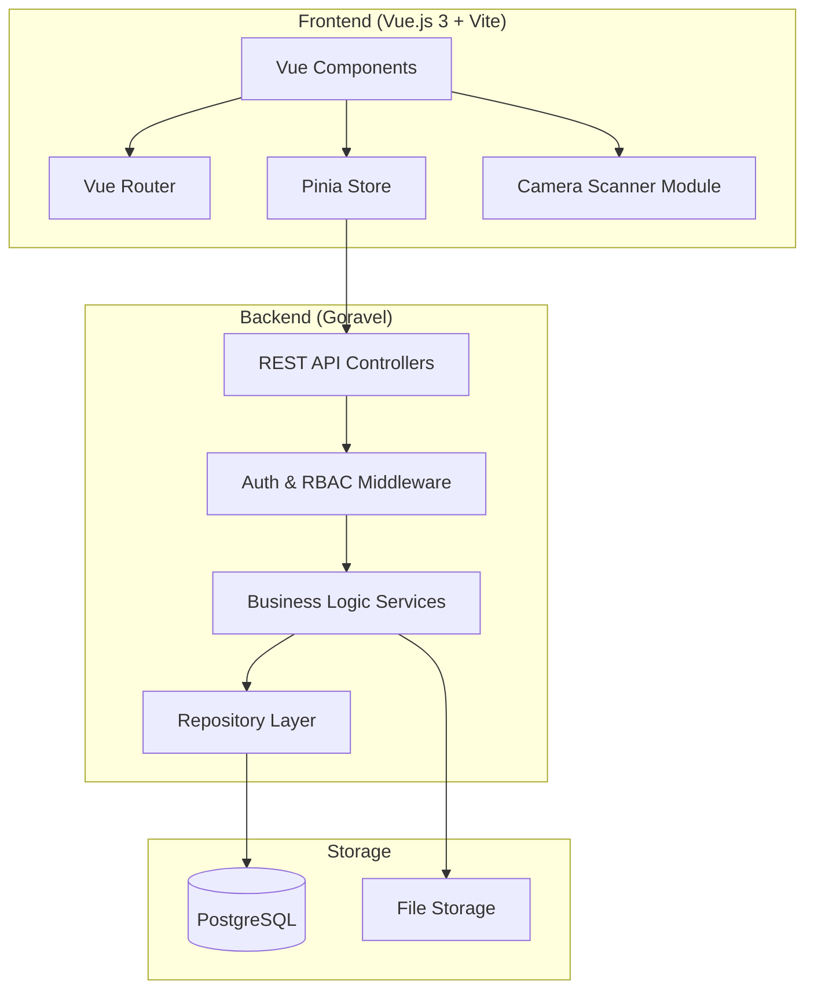
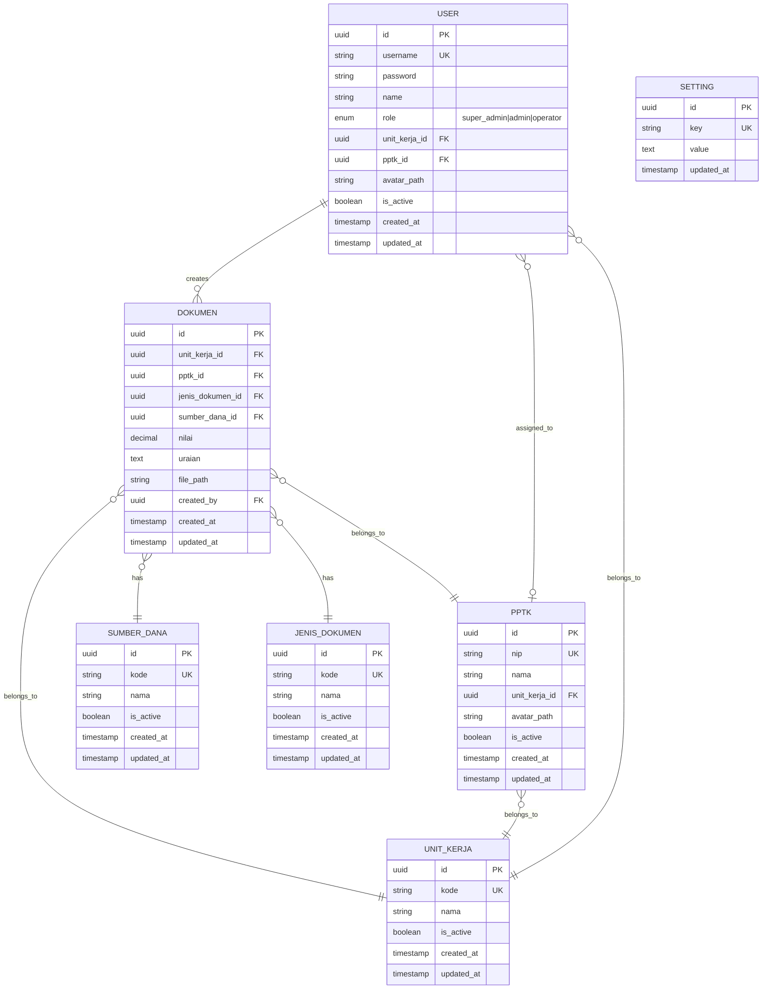

# Design Document: Manajemen Dokumen Keuangan

## Overview

Sistem Manajemen Dokumen Keuangan adalah aplikasi full web responsive yang dibangun dengan arsitektur separated (API + SPA). Backend menggunakan Goravel (Go) sebagai REST API, frontend menggunakan Vue.js 3 sebagai Single Page Application, dan PostgreSQL sebagai database.

Sistem mendukung tiga role: Super Admin (full access), Admin (manajemen data master), dan Operator (input dokumen). Fitur utama meliputi input dokumen keuangan dengan scanner browser, import/export Excel, dan manajemen data master.

## Architecture



### Architecture Pattern

- **Backend**: Clean Architecture dengan Repository Pattern
- **Frontend**: Component-based dengan Composition API
- **Communication**: REST API dengan JSON
- **Authentication**: JWT (Access Token + Refresh Token)

### Docker Desktop Development Environment

```yaml
# docker-compose.yml
version: "3.8"

services:
  # PostgreSQL Database
  db:
    image: postgres:16-alpine
    container_name: dokumen_keuangan_db
    environment:
      POSTGRES_USER: dokumen_user
      POSTGRES_PASSWORD: dokumen_pass
      POSTGRES_DB: dokumen_keuangan
    ports:
      - "5432:5432"
    volumes:
      - postgres_data:/var/lib/postgresql/data
    networks:
      - dokumen_network

  # Goravel Backend
  backend:
    build:
      context: ./backend
      dockerfile: Dockerfile
    container_name: dokumen_keuangan_backend
    environment:
      APP_ENV: local
      DB_HOST: db
      DB_PORT: 5432
      DB_DATABASE: dokumen_keuangan
      DB_USERNAME: dokumen_user
      DB_PASSWORD: dokumen_pass
    ports:
      - "8000:8000"
    volumes:
      - ./backend:/app
      - file_storage:/app/storage/app/public
    depends_on:
      - db
    networks:
      - dokumen_network

  # Vue.js Frontend
  frontend:
    build:
      context: ./frontend
      dockerfile: Dockerfile
    container_name: dokumen_keuangan_frontend
    environment:
      VITE_API_URL: http://localhost:8000/api
    ports:
      - "5173:5173"
    volumes:
      - ./frontend:/app
      - /app/node_modules
    depends_on:
      - backend
    networks:
      - dokumen_network

volumes:
  postgres_data:
  file_storage:

networks:
  dokumen_network:
    driver: bridge
```

### Dockerfile - Backend (Goravel)

```dockerfile
# backend/Dockerfile
FROM golang:1.22-alpine

WORKDIR /app

# Install air for hot reload
RUN go install github.com/cosmtrek/air@latest

# Install dependencies
RUN apk add --no-cache git

# Copy go mod files
COPY go.mod go.sum ./
RUN go mod download

# Copy source code
COPY . .

# Expose port
EXPOSE 8000

# Run with hot reload for development
CMD ["air", "-c", ".air.toml"]
```

### Dockerfile - Frontend (Vue.js)

```dockerfile
# frontend/Dockerfile
FROM node:20-alpine

WORKDIR /app

# Copy package files
COPY package*.json ./
RUN npm install

# Copy source code
COPY . .

# Expose Vite dev server port
EXPOSE 5173

# Run development server with host binding
CMD ["npm", "run", "dev", "--", "--host", "0.0.0.0"]
```

### Development Commands

```bash
# Start all services
docker-compose up -d

# View logs
docker-compose logs -f

# Stop all services
docker-compose down

# Rebuild after Dockerfile changes
docker-compose up -d --build

# Run database migrations
docker-compose exec backend go run . artisan migrate

# Access database shell
docker-compose exec db psql -U dokumen_user -d dokumen_keuangan
```

## Components and Interfaces

### Backend Components

#### 1. Controllers (HTTP Layer)

```
app/http/controllers/
├── auth_controller.go          # Login, logout, refresh token
├── user_controller.go          # CRUD users, avatar upload
├── unit_kerja_controller.go    # CRUD + Excel import/export
├── pptk_controller.go          # CRUD + Excel import/export + avatar
├── sumber_dana_controller.go   # CRUD sumber dana
├── jenis_dokumen_controller.go # CRUD jenis dokumen
├── dokumen_controller.go       # Input dokumen, list, filter
└── setting_controller.go       # System settings
```

#### 2. Services (Business Logic)

```
app/services/
├── auth_service.go
├── user_service.go
├── unit_kerja_service.go
├── pptk_service.go
├── sumber_dana_service.go
├── jenis_dokumen_service.go
├── dokumen_service.go
├── excel_service.go            # Excel import/export logic
└── file_service.go             # File upload/storage logic
```

#### 3. Repositories (Data Access)

```
app/repositories/
├── user_repository.go
├── unit_kerja_repository.go
├── pptk_repository.go
├── sumber_dana_repository.go
├── jenis_dokumen_repository.go
├── dokumen_repository.go
└── setting_repository.go
```

#### 4. Middleware

```
app/http/middleware/
├── auth_middleware.go          # JWT validation
├── role_middleware.go          # RBAC check
└── cors_middleware.go          # CORS handling
```

### Frontend Components

#### 1. Pages/Views

```
src/views/
├── auth/
│   └── LoginView.vue
├── dashboard/
│   └── DashboardView.vue
├── dokumen/
│   ├── InputDokumenView.vue
│   └── ListDokumenView.vue
├── master/
│   ├── UnitKerjaView.vue
│   ├── PPTKView.vue
│   ├── SumberDanaView.vue
│   └── JenisDokumenView.vue
├── user/
│   └── ManajemenUserView.vue
└── setting/
    └── PengaturanView.vue
```

#### 2. Reusable Components

```
src/components/
├── common/
│   ├── DataTable.vue
│   ├── Modal.vue
│   ├── Dropdown.vue
│   └── FileUpload.vue
├── scanner/
│   └── DocumentScanner.vue     # Camera scanner component
├── form/
│   ├── InputField.vue
│   └── CurrencyInput.vue
└── layout/
    ├── Sidebar.vue
    ├── Navbar.vue
    └── MainLayout.vue
```

#### 3. Composables

```
src/composables/
├── useAuth.js
├── useApi.js
├── useScanner.js               # Camera & PDF generation
└── useExcel.js                 # Excel template download
```

### API Endpoints

#### Authentication

| Method | Endpoint          | Description      |
| ------ | ----------------- | ---------------- |
| POST   | /api/auth/login   | User login       |
| POST   | /api/auth/logout  | User logout      |
| POST   | /api/auth/refresh | Refresh token    |
| GET    | /api/auth/me      | Get current user |

#### Users (Super Admin only)

| Method | Endpoint              | Description            |
| ------ | --------------------- | ---------------------- |
| GET    | /api/users            | List all users         |
| POST   | /api/users            | Create user            |
| GET    | /api/users/:id        | Get user detail        |
| PUT    | /api/users/:id        | Update user            |
| DELETE | /api/users/:id        | Delete/deactivate user |
| POST   | /api/users/:id/avatar | Upload avatar          |

#### Unit Kerja (Admin+)

| Method | Endpoint                 | Description             |
| ------ | ------------------------ | ----------------------- |
| GET    | /api/unit-kerja          | List all                |
| POST   | /api/unit-kerja          | Create                  |
| PUT    | /api/unit-kerja/:id      | Update                  |
| DELETE | /api/unit-kerja/:id      | Delete                  |
| GET    | /api/unit-kerja/template | Download Excel template |
| POST   | /api/unit-kerja/import   | Import from Excel       |

#### PPTK (Admin+)

| Method | Endpoint                             | Description             |
| ------ | ------------------------------------ | ----------------------- |
| GET    | /api/pptk                            | List all                |
| POST   | /api/pptk                            | Create                  |
| PUT    | /api/pptk/:id                        | Update                  |
| DELETE | /api/pptk/:id                        | Delete                  |
| POST   | /api/pptk/:id/avatar                 | Upload avatar           |
| GET    | /api/pptk/template                   | Download Excel template |
| POST   | /api/pptk/import                     | Import from Excel       |
| GET    | /api/pptk/by-unit-kerja/:unitKerjaId | Get PPTK by Unit Kerja  |

#### Sumber Dana (Admin+)

| Method | Endpoint             | Description |
| ------ | -------------------- | ----------- |
| GET    | /api/sumber-dana     | List all    |
| POST   | /api/sumber-dana     | Create      |
| PUT    | /api/sumber-dana/:id | Update      |
| DELETE | /api/sumber-dana/:id | Delete      |

#### Jenis Dokumen (Admin+)

| Method | Endpoint               | Description |
| ------ | ---------------------- | ----------- |
| GET    | /api/jenis-dokumen     | List all    |
| POST   | /api/jenis-dokumen     | Create      |
| PUT    | /api/jenis-dokumen/:id | Update      |
| DELETE | /api/jenis-dokumen/:id | Delete      |

#### Dokumen (All authenticated)

| Method | Endpoint              | Description                       |
| ------ | --------------------- | --------------------------------- |
| GET    | /api/dokumen          | List documents (filtered by role) |
| POST   | /api/dokumen          | Create document                   |
| GET    | /api/dokumen/:id      | Get document detail               |
| GET    | /api/dokumen/:id/file | Download PDF file                 |

#### Settings (Super Admin only)

| Method | Endpoint      | Description      |
| ------ | ------------- | ---------------- |
| GET    | /api/settings | Get all settings |
| PUT    | /api/settings | Update settings  |

## Data Models

### Entity Relationship Diagram



### Go Struct Definitions

```go
// User model
type User struct {
    ID          uuid.UUID  `gorm:"type:uuid;primary_key"`
    Username    string     `gorm:"uniqueIndex;not null"`
    Password    string     `gorm:"not null"`
    Name        string     `gorm:"not null"`
    Role        string     `gorm:"not null"` // super_admin, admin, operator
    UnitKerjaID *uuid.UUID `gorm:"type:uuid"`
    PPTKID      *uuid.UUID `gorm:"type:uuid"`
    AvatarPath  *string
    IsActive    bool       `gorm:"default:true"`
    CreatedAt   time.Time
    UpdatedAt   time.Time

    UnitKerja   *UnitKerja `gorm:"foreignKey:UnitKerjaID"`
    PPTK        *PPTK      `gorm:"foreignKey:PPTKID"`
}

// UnitKerja model
type UnitKerja struct {
    ID        uuid.UUID `gorm:"type:uuid;primary_key"`
    Kode      string    `gorm:"uniqueIndex;not null"`
    Nama      string    `gorm:"not null"`
    IsActive  bool      `gorm:"default:true"`
    CreatedAt time.Time
    UpdatedAt time.Time
}

// PPTK model
type PPTK struct {
    ID          uuid.UUID  `gorm:"type:uuid;primary_key"`
    NIP         string     `gorm:"uniqueIndex;not null"`
    Nama        string     `gorm:"not null"`
    UnitKerjaID uuid.UUID  `gorm:"type:uuid;not null"`
    AvatarPath  *string
    IsActive    bool       `gorm:"default:true"`
    CreatedAt   time.Time
    UpdatedAt   time.Time

    UnitKerja   UnitKerja  `gorm:"foreignKey:UnitKerjaID"`
}

// SumberDana model
type SumberDana struct {
    ID        uuid.UUID `gorm:"type:uuid;primary_key"`
    Kode      string    `gorm:"uniqueIndex;not null"`
    Nama      string    `gorm:"not null"`
    IsActive  bool      `gorm:"default:true"`
    CreatedAt time.Time
    UpdatedAt time.Time
}

// JenisDokumen model
type JenisDokumen struct {
    ID        uuid.UUID `gorm:"type:uuid;primary_key"`
    Kode      string    `gorm:"uniqueIndex;not null"`
    Nama      string    `gorm:"not null"`
    IsActive  bool      `gorm:"default:true"`
    CreatedAt time.Time
    UpdatedAt time.Time
}

// Dokumen model
type Dokumen struct {
    ID             uuid.UUID `gorm:"type:uuid;primary_key"`
    UnitKerjaID    uuid.UUID `gorm:"type:uuid;not null"`
    PPTKID         uuid.UUID `gorm:"type:uuid;not null"`
    JenisDokumenID uuid.UUID `gorm:"type:uuid;not null"`
    SumberDanaID   uuid.UUID `gorm:"type:uuid;not null"`
    Nilai          float64   `gorm:"type:decimal(15,2);not null"`
    Uraian         string    `gorm:"type:text;not null"`
    FilePath       string    `gorm:"not null"`
    CreatedBy      uuid.UUID `gorm:"type:uuid;not null"`
    CreatedAt      time.Time
    UpdatedAt      time.Time

    UnitKerja    UnitKerja    `gorm:"foreignKey:UnitKerjaID"`
    PPTK         PPTK         `gorm:"foreignKey:PPTKID"`
    JenisDokumen JenisDokumen `gorm:"foreignKey:JenisDokumenID"`
    SumberDana   SumberDana   `gorm:"foreignKey:SumberDanaID"`
    Creator      User         `gorm:"foreignKey:CreatedBy"`
}
```

## Correctness Properties

_A property is a characteristic or behavior that should hold true across all valid executions of a system-essentially, a formal statement about what the system should do. Properties serve as the bridge between human-readable specifications and machine-verifiable correctness guarantees._

### Property 1: User Creation Persistence

_For any_ valid user data (username, password, role), when a Super Admin creates the user, the system should store all fields correctly and the user should be retrievable with the same data.
**Validates: Requirements 1.1**

### Property 2: Operator Assignment Integrity

_For any_ Operator, PPTK, and Unit Kerja combination, when assigned, the Operator should be linked to both entities and these relationships should be queryable.
**Validates: Requirements 1.2**

### Property 3: Avatar Upload Persistence

_For any_ valid image file uploaded as avatar (for User or PPTK), the system should store the file and associate the file path with the entity.
**Validates: Requirements 1.3, 3.6**

### Property 4: User Deactivation Blocks Login

_For any_ active user, when deactivated by Super Admin, subsequent login attempts with valid credentials should fail.
**Validates: Requirements 1.5**

### Property 5: Master Data CRUD Consistency

_For any_ master data entity (Unit Kerja, PPTK, Sumber Dana, Jenis Dokumen), create and update operations should persist all fields correctly and be retrievable with the same values.
**Validates: Requirements 2.1, 3.1, 4.1, 4.2, 5.1, 5.2**

### Property 6: Referential Integrity on Delete

_For any_ master data entity (Sumber Dana, Jenis Dokumen) that is referenced by existing documents, delete operation should fail and return an error.
**Validates: Requirements 4.3, 5.3**

### Property 7: Excel Import Creates All Valid Records

_For any_ valid Excel file with N rows of data (Unit Kerja or PPTK), import operation should create exactly N records in the database.
**Validates: Requirements 2.3, 3.4**

### Property 8: Excel Import Error Reporting

_For any_ Excel file containing invalid data, import operation should return validation errors that include the specific row numbers of invalid entries.
**Validates: Requirements 2.4, 3.5**

### Property 9: Operator Default Selection

_For any_ Operator with assigned Unit Kerja and PPTK, when accessing the document input form, the dropdowns should default to the Operator's assigned values.
**Validates: Requirements 6.1, 6.2**

### Property 10: Document Creation Completeness

_For any_ valid document submission (Unit Kerja, PPTK, Jenis Dokumen, Sumber Dana, Nilai, Uraian, PDF file), all fields should be stored and retrievable.
**Validates: Requirements 6.3**

### Property 11: PDF File Type Validation

_For any_ uploaded file, the system should accept only PDF files and reject other file types with appropriate error message.
**Validates: Requirements 6.4**

### Property 12: Document Validation Errors

_For any_ document submission with missing required fields, the system should return validation errors identifying each missing field.
**Validates: Requirements 6.5**

### Property 13: Currency Value Handling

_For any_ numeric Nilai input, the system should store the value correctly and format it as currency when displayed.
**Validates: Requirements 6.6**

### Property 14: Image to PDF Conversion

_For any_ captured image from scanner, the system should produce a valid PDF file containing the image.
**Validates: Requirements 7.2**

### Property 15: Multi-page PDF Combination

_For any_ set of N scanned images, the system should produce a single PDF file with exactly N pages.
**Validates: Requirements 7.3**

### Property 16: Admin Document Visibility

_For any_ Admin or Super Admin user, the hasil inputan table should return all documents in the system with complete field information.
**Validates: Requirements 8.1**

### Property 17: Operator Document Isolation

_For any_ Operator user, the hasil inputan table should return only documents where created_by matches the Operator's ID.
**Validates: Requirements 8.2**

### Property 18: Unit Kerja Filter Accuracy

_For any_ Unit Kerja filter applied to document list, all returned documents should have matching unit_kerja_id.
**Validates: Requirements 8.3**

### Property 19: Date Range Filter Accuracy

_For any_ date range filter (start_date, end_date) applied to document list, all returned documents should have created_at within the specified range.
**Validates: Requirements 8.4**

### Property 20: Settings Persistence

_For any_ setting update by Super Admin, the new value should be persisted and returned on subsequent retrieval.
**Validates: Requirements 9.2**

### Property 21: Authentication Success

_For any_ user with valid credentials, login should succeed and return a valid JWT token.
**Validates: Requirements 10.1**

### Property 22: Authentication Failure

_For any_ invalid credentials (wrong username or password), login should fail with appropriate error message.
**Validates: Requirements 10.2**

### Property 23: Role-Based Access Control

_For any_ user with role R attempting to access endpoint requiring role R', where R has lower privilege than R', the system should deny access with 403 status.
**Validates: Requirements 10.3, 10.4**

### Property 24: Session Expiration Handling

_For any_ expired JWT token, API requests should fail with 401 status indicating session expiration.
**Validates: Requirements 10.5**

## Error Handling

### Backend Error Handling

1. **Validation Errors (400)**

   - Return structured JSON with field-specific error messages
   - Format: `{ "errors": { "field_name": ["error message"] } }`

2. **Authentication Errors (401)**

   - Invalid/expired token: `{ "error": "Token expired or invalid" }`
   - Missing token: `{ "error": "Authentication required" }`

3. **Authorization Errors (403)**

   - Insufficient role: `{ "error": "Access denied. Required role: admin" }`

4. **Not Found Errors (404)**

   - Resource not found: `{ "error": "Resource not found" }`

5. **Conflict Errors (409)**

   - Duplicate entry: `{ "error": "Username already exists" }`
   - Referential integrity: `{ "error": "Cannot delete: referenced by 5 documents" }`

6. **Server Errors (500)**
   - Generic error with logged details
   - Response: `{ "error": "Internal server error" }`

### Frontend Error Handling

1. **API Error Interceptor**

   - Catch all API errors in axios interceptor
   - Display toast notifications for user-friendly messages
   - Redirect to login on 401 errors

2. **Form Validation**

   - Client-side validation before submission
   - Display inline error messages per field
   - Highlight invalid fields

3. **File Upload Errors**
   - Validate file type and size before upload
   - Show progress indicator during upload
   - Display specific error for failed uploads

## Testing Strategy

### Unit Testing

**Backend (Go)**

- Framework: Go built-in testing + testify
- Coverage target: 80%
- Focus areas:
  - Service layer business logic
  - Repository data access
  - Validation functions
  - Excel parsing logic

**Frontend (Vue.js)**

- Framework: Vitest + Vue Test Utils
- Coverage target: 70%
- Focus areas:
  - Component rendering
  - Form validation
  - State management (Pinia stores)
  - Composable functions

### Property-Based Testing

**Framework**: gopter (Go) for backend, fast-check (JavaScript) for frontend

**Backend Properties to Test:**

- User creation with random valid data
- Excel import with generated valid/invalid data
- Document filtering with random filter combinations
- RBAC with random role/endpoint combinations

**Frontend Properties to Test:**

- Currency formatting with random numeric values
- Image to PDF conversion with random images
- Form validation with random input combinations

### Integration Testing

- API endpoint testing with httptest (Go)
- Database integration with test containers
- File upload/download flow testing

### E2E Testing (Optional)

- Framework: Playwright or Cypress
- Critical user flows:
  - Login → Input Document → View List
  - Admin → Import Excel → Verify Data
  - Scanner → Capture → Submit Document
